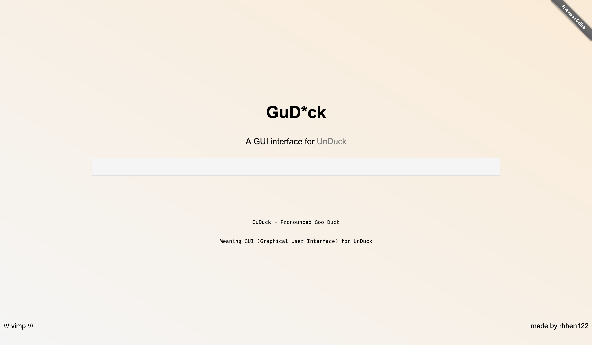

# GuD*ck

GuDuck is a `GUI` Version on `UnDuck`!
Personally I think it looks really pretty <u>cool</u>.
To use it simply go to the URL <a href="https://guduck.org/">GuDuck.org</a> and type in your query!
GuDuck uses DuckDuckGos `!Bangs` but <b>faster</b>! GuDuck Is extremely simple and Open-Source!

## Why did I make it?
I Really wanted to use UnDuck but there was no GUI search engine site. I thought to myself, this is very simple and I could do it myself.
Its really simple to use it and you can download and make contributions here.
Currently GuDuck doesnt have any [JS] but i plan to add more features to it when nessacary.

## How to use !Bangs Optimally
There are over 13,000 !Bnags and counting and you might be asking to how to use them optimally.

Step 1

There is a whole bunch of !Bangs such as:

!g {Google}

!gi {Google Images}

!b {Bing}

!gh {GitHub}

Learn these and memorise them. You can also search up more !Bnags or discorver more.

### Enjoy!